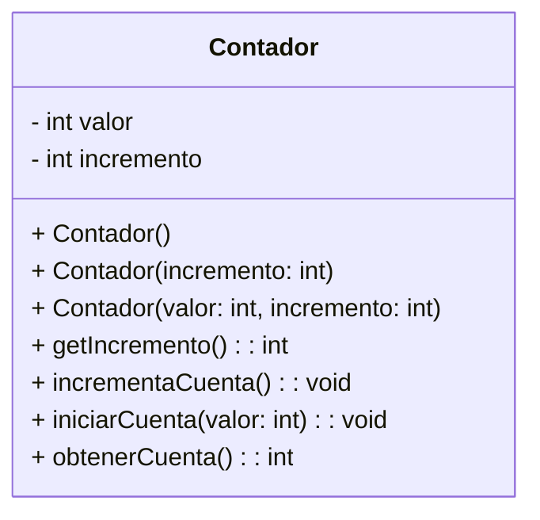

```mermaid
classDiagram
class Contador{
- int valor
- int incremento
+ Contador()
+ Contador(incremento: int)
+ Contador(valor: int, incremento: int)
+ getIncremento(): int
+ incrementaCuenta(): void
+ iniciarCuenta(valor: int): void
+ obtenerCuenta(): int
}
```