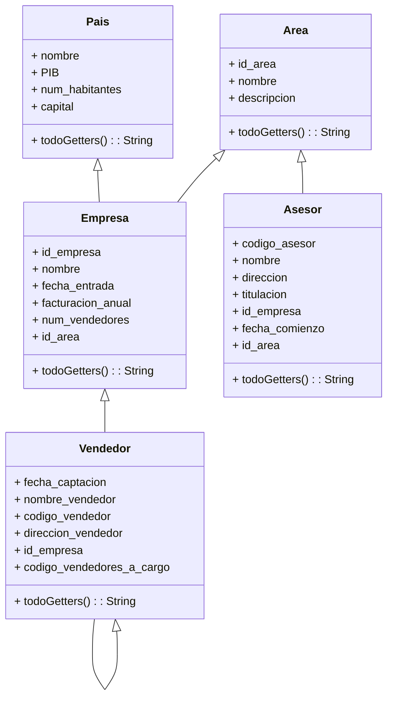

```mermaid
classDiagram
    class Vendedor{
        + fecha_captacion
        + nombre_vendedor
        + codigo_vendedor
        + direccion_vendedor
        + id_empresa
        + codigo_vendedores_a_cargo

        + todoGetters(): String
    }
      class Empresa{
        + id_empresa
        + nombre 
        + fecha_entrada
        + facturacion_anual
        + num_vendedores
        + id_area
        + todoGetters(): String
    }
    class Area{
        + id_area
        + nombre 
        + descripcion
        + todoGetters(): String
    }
    class Pais{
        + nombre 
        + PIB
        + num_habitantes
        + capital
        + todoGetters(): String
    }
    class Asesor{
        + codigo_asesor
        + nombre 
        + direccion
        + titulacion
        + id_empresa
        + fecha_comienzo
        + id_area

        + todoGetters(): String
    }
   


    Empresa <|-- Vendedor
    Vendedor <|-- Vendedor
    Area <|-- Empresa
    Area <|-- Asesor
    Pais <|-- Empresa
 
```