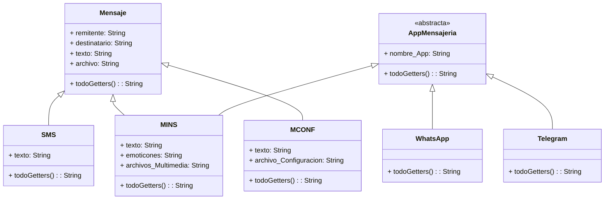

```mermaid
classDiagram
    class Mensaje {
        + remitente: String
        + destinatario: String
        + texto: String
        + archivo: String
        + todoGetters(): String
    }

    class SMS {
        + texto: String
        + todoGetters(): String
    }

    class MINS {
        + texto: String
        + emoticones: String
        + archivos_Multimedia: String
        + todoGetters(): String
    }

    class MCONF {
        + texto: String
        + archivo_Configuracion: String
        + todoGetters(): String
    }

    class AppMensajeria {
        <<abstracta>>
        + nombre_App: String
        + todoGetters(): String
    }

    class WhatsApp {
        + todoGetters(): String
    }

    class Telegram {
        + todoGetters(): String
    }

    Mensaje <|-- SMS
    Mensaje <|-- MINS
    Mensaje <|-- MCONF
    AppMensajeria <|-- WhatsApp
    AppMensajeria <|-- Telegram
    AppMensajeria <|-- MINS
```