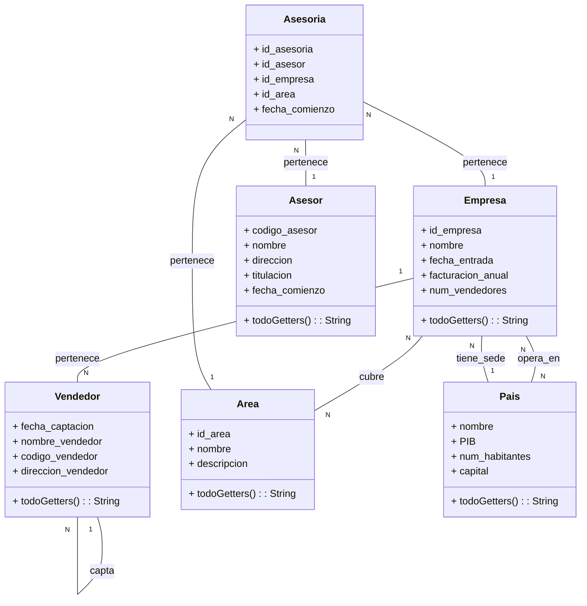

```mermaid
classDiagram
    class Vendedor{
        + fecha_captacion
        + nombre_vendedor
        + codigo_vendedor
        + direccion_vendedor
        + todoGetters(): String
    }
      class Empresa{
        + id_empresa
        + nombre 
        + fecha_entrada
        + facturacion_anual
        + num_vendedores
        + todoGetters(): String
    }
    class Area{
        + id_area
        + nombre 
        + descripcion
        + todoGetters(): String
    }
    class Pais{
        + nombre 
        + PIB
        + num_habitantes
        + capital
        + todoGetters(): String
    }
    class Asesoria{
        + id_asesoria
        + id_asesor
        + id_empresa
        + id_area
        + fecha_comienzo
    }
    class Asesor{
        + codigo_asesor
        + nombre 
        + direccion
        + titulacion
        + fecha_comienzo

        + todoGetters(): String
    }
   


    Empresa "N" -- "N" Area : cubre
    Empresa "N" -- "N" Pais : opera_en
    Empresa "N" -- "1" Pais : tiene_sede
    Vendedor "1" -- "N" Vendedor : capta
    Empresa "1" -- "N" Vendedor : pertenece
    Asesoria "N" -- "1" Asesor : pertenece
    Asesoria "N" -- "1" Empresa : pertenece
    Asesoria "N" -- "1" Area : pertenece

 
```