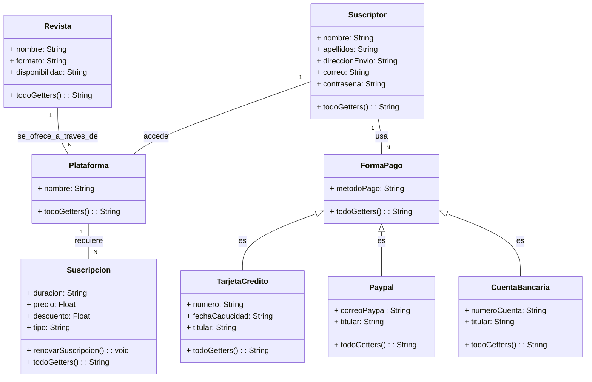

```mermaid
classDiagram
    class Revista{
        + nombre: String
        + formato: String
        + disponibilidad: String
        + todoGetters(): String

    }
    
    class Suscripcion{
        + duracion: String
        + precio: Float
        + descuento: Float
        + tipo: String
        + renovarSuscripcion(): void
        + todoGetters(): String
    }

    class Suscriptor{
        + nombre: String
        + apellidos: String
        + direccionEnvio: String
        + correo: String
        + contrasena: String
        + todoGetters(): String
    }

    class FormaPago{
        + metodoPago: String
        + todoGetters(): String
    }

    class TarjetaCredito{
        + numero: String
        + fechaCaducidad: String
        + titular: String
        + todoGetters(): String
    }

    class Paypal{
        + correoPaypal: String
        + titular: String
        + todoGetters(): String
    }

    class CuentaBancaria{
        + numeroCuenta: String
        + titular: String
        + todoGetters(): String
    }

    class Plataforma{
        + nombre: String
        + todoGetters(): String
    }

    Suscriptor "1" -- "N" FormaPago : usa
    FormaPago <|-- TarjetaCredito : es
    FormaPago <|-- Paypal : es
    FormaPago <|-- CuentaBancaria : es
    Revista "1" -- "N" Plataforma : se_ofrece_a_traves_de
    Plataforma "1" -- "N" Suscripcion : requiere
    Suscriptor "1" -- "N" Plataforma : accede
```