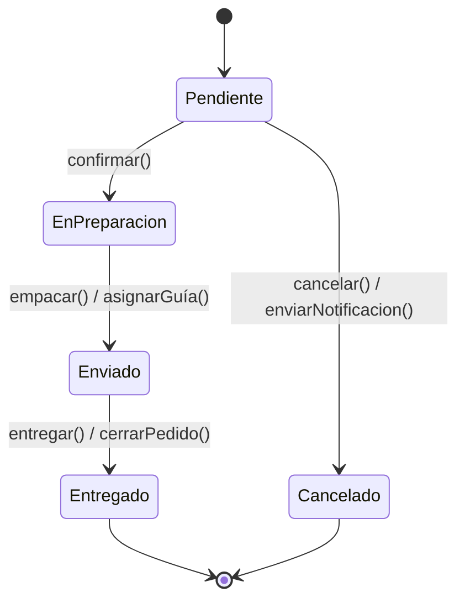
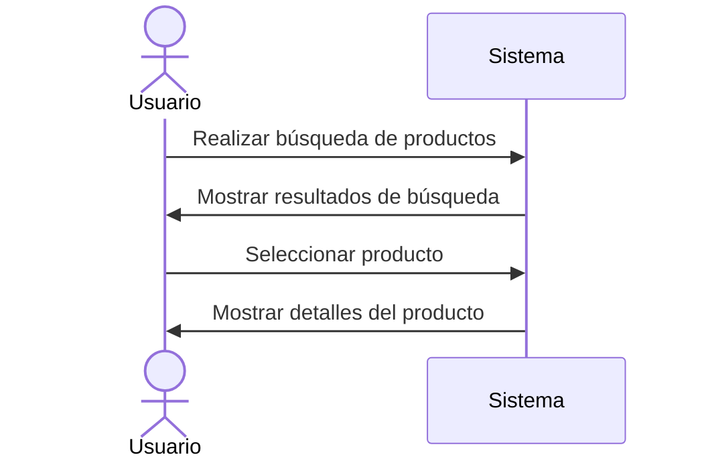

### Caso de Estudio: Sistema de Gestión Integral de Almacenes y Stock

#### Requisitos Funcionales

| **ID**   | **Descripción**                                                                                          | **Prioridad** | **Fuente**         | **Estado**     |
|----------|----------------------------------------------------------------------------------------------------------|---------------|---------------------|----------------|
| RF-01    | Registrar y dar de alta productos con atributos como código, descripción, dimensiones, lote y caducidad. | Alta          | Cliente             | Propuesto      |
| RF-02    | Gestionar múltiples almacenes y ubicaciones internas (pasillos, estantes, zonas de picking).             | Media         | Analista Funcional  | Propuesto      |
| RF-03    | Permitir ajustes de inventario: recepciones, traslados, mermas y devoluciones.                           | Alta          | Cliente             | Propuesto      |
| RF-04    | Mostrar niveles de stock en tiempo real y ofrecer vistas históricas de movimientos.                      | Alta          | Cliente             | Propuesto      |
| RF-05    | Crear órdenes de salida para clientes o producción.                                                      | Media         | Responsable Logístico | Propuesto    |
| RF-06    | Generar listados de picking con rutas optimizadas.                                                       | Media         | Stakeholder Interno | Propuesto      |
| RF-07    | Confirmar preparación, embalaje y expedición de pedidos.                                                 | Media         | Cliente             | Propuesto      |
| RF-08    | Integrarse con transportistas para generar etiquetas y seguimiento de envíos.                            | Media         | Departamento TI     | Propuesto      |
| RF-09    | Enviar alertas automáticas por umbrales mínimos/máximos de stock.                                        | Media         | Cliente             | Propuesto      |
| RF-10    | Notificar recepciones tardías, discrepancias o caducidades próximas.                                     | Media         | Normativa Interna   | Propuesto      |
| RF-11    | Programar recordatorios de recuentos cíclicos periódicos.                                                | Baja          | Cliente             | Propuesto      |
| RF-12    | Mostrar dashboards con KPIs: rotación, antigüedad, cumplimiento y eficiencia.                            | Alta          | Dirección Operativa | Propuesto      |
| RF-13    | Permitir exportar reportes en formatos CSV y PDF.                                                        | Media         | Cliente             | Propuesto      |
| RF-14    | Aplicar control de accesos por roles con autenticación multifactor.                                      | Alta          | Departamento TI     | Propuesto      |
| RF-15    | Registrar auditoría de acciones críticas (quién, cuándo, qué).                                           | Alta          | Normativa           | Propuesto      |

#### Requisitos No Funcionales

| **ID**   | **Descripción**                                                                  | **Categoría**  | **Métrica**               | **Nivel Objetivo**     | **Comentarios**                                  |
|----------|----------------------------------------------------------------------------------|----------------|---------------------------|------------------------|--------------------------------------------------|
| RNF-01   | La respuesta para consultas de stock debe ser inferior a 2 segundos.            | Rendimiento    | Tiempo de respuesta       | < 2 segundos           | Evaluar con pruebas de estrés periódicas.       |
| RNF-02   | El sistema debe soportar al menos 500 usuarios simultáneos.                     | Escalabilidad  | Usuarios concurrentes     | ≥ 500 usuarios         | Considerar arquitectura distribuida.            |
| RNF-03   | Cifrado de datos sensibles en tránsito y reposo usando AES-256.                 | Seguridad      | Cifrado aplicado          | Obligatorio            | Cumplir con normativa ISO/IEC 27001.            |
| RNF-04   | La autenticación debe requerir doble factor para usuarios con acceso crítico.   | Seguridad      | Tipo de autenticación     | MFA obligatorio        | Aplicado en roles administrativos.              |
| RNF-05   | Interfaz accesible conforme a WCAG 2.1 nivel AA.                                | Usabilidad     | Nivel de accesibilidad    | Nivel AA               | Verificado por auditoría externa.               |
| RNF-06   | Disponibilidad del sistema debe ser al menos del 99.5%.                         | Fiabilidad     | Porcentaje de uptime      | ≥ 99.5%                | Monitorización activa 24/7.                     |
| RNF-07   | Los reportes deben generarse en menos de 5 segundos para datos de un mes.       | Rendimiento    | Tiempo de generación      | ≤ 5 segundos           | Validar con datos reales de producción.         |
| RNF-08   | La arquitectura debe permitir integración con sistemas ERP externos.            | Interoperabilidad | APIs REST compatibles  | RESTful documentadas   | Usar estándares OpenAPI.                        |

### En estado he puesto en todos propuestos ya que se trata de una actividad y no se va a realizar realmente.

## Requisitos Funcionales

### RF-01
| **Campo**      | **Descripción**                                                                                          |
|----------------|----------------------------------------------------------------------------------------------------------|
| **ID**         | RF-01                                                                                                     |
| **Descripción**| Registrar y dar de alta productos con atributos como código, descripción, dimensiones, lote y caducidad. |
| **Prioridad**  | Alta                                                                                                     |
| **Fuente**     | Cliente                                                                                                  |
| **Estado**     | Propuesto                                                                                                 |

### RF-02
| **Campo**      | **Descripción**                                                                 |
|----------------|---------------------------------------------------------------------------------|
| **ID**         | RF-02                                                                          |
| **Descripción**| Gestionar múltiples almacenes y ubicaciones internas (pasillos, estantes, zonas de picking). |
| **Prioridad**  | Media                                                                          |
| **Fuente**     | Analista Funcional                                                             |
| **Estado**     | Propuesto                                                                      |

### RF-03
| **Campo**      | **Descripción**                                                              |
|----------------|------------------------------------------------------------------------------|
| **ID**         | RF-03                                                                        |
| **Descripción**| Permitir ajustes de inventario: recepciones, traslados, mermas y devoluciones. |
| **Prioridad**  | Alta                                                                         |
| **Fuente**     | Cliente                                                                      |
| **Estado**     | Propuesto                                                                    |

### RF-04
| **Campo**      | **Descripción**                                                                    |
|----------------|------------------------------------------------------------------------------------|
| **ID**         | RF-04                                                                              |
| **Descripción**| Mostrar niveles de stock en tiempo real y ofrecer vistas históricas de movimientos. |
| **Prioridad**  | Alta                                                                               |
| **Fuente**     | Cliente                                                                            |
| **Estado**     | Propuesto                                                                          |

### RF-05
| **Campo**      | **Descripción**                                          |
|----------------|----------------------------------------------------------|
| **ID**         | RF-05                                                   |
| **Descripción**| Crear órdenes de salida para clientes o producción.      |
| **Prioridad**  | Media                                                   |
| **Fuente**     | Responsable Logístico                                   |
| **Estado**     | Propuesto                                               |

### RF-06
| **Campo**      | **Descripción**                                              |
|----------------|--------------------------------------------------------------|
| **ID**         | RF-06                                                       |
| **Descripción**| Generar listados de picking con rutas optimizadas.          |
| **Prioridad**  | Media                                                       |
| **Fuente**     | Stakeholder Interno                                         |
| **Estado**     | Propuesto                                                   |

### RF-07
| **Campo**      | **Descripción**                                                   |
|----------------|-------------------------------------------------------------------|
| **ID**         | RF-07                                                              |
| **Descripción**| Confirmar preparación, embalaje y expedición de pedidos.          |
| **Prioridad**  | Media                                                              |
| **Fuente**     | Cliente                                                             |
| **Estado**     | Propuesto                                                           |

### RF-08
| **Campo**      | **Descripción**                                                       |
|----------------|-----------------------------------------------------------------------|
| **ID**         | RF-08                                                                  |
| **Descripción**| Integración con transportistas para etiquetas y seguimiento de envíos.|
| **Prioridad**  | Media                                                                  |
| **Fuente**     | Cliente                                                                |
| **Estado**     | Propuesto                                                              |

### RF-09
| **Campo**      | **Descripción**                                                                |
|----------------|--------------------------------------------------------------------------------|
| **ID**         | RF-09                                                                          |
| **Descripción**| Alertas automáticas por umbrales mínimos/máximos de stock.                    |
| **Prioridad**  | Alta                                                                           |
| **Fuente**     | Responsable de Inventario                                                      |
| **Estado**     | Propuesto                                                                      |

### RF-10
| **Campo**      | **Descripción**                                                                              |
|----------------|----------------------------------------------------------------------------------------------|
| **ID**         | RF-10                                                                                        |
| **Descripción**| Notificaciones por correo o interfaz ante recepciones tardías, discrepancias o productos por caducar. |
| **Prioridad**  | Alta                                                                                         |
| **Fuente**     | Cliente                                                                                      |
| **Estado**     | Propuesto                                                                                    |

### RF-11
| **Campo**      | **Descripción**                                                    |
|----------------|--------------------------------------------------------------------|
| **ID**         | RF-11                                                               |
| **Descripción**| Recordatorios de recuentos cíclicos (inventarios periódicos).     |
| **Prioridad**  | Media                                                               |
| **Fuente**     | Analista Funcional                                                  |
| **Estado**     | Propuesto                                                           |

### RF-12
| **Campo**      | **Descripción**                                                       |
|----------------|-----------------------------------------------------------------------|
| **ID**         | RF-12                                                                  |
| **Descripción**| Dashboards de inventario: rotación, antigüedad y cumplimiento de pedidos. |
| **Prioridad**  | Media                                                                  |
| **Fuente**     | Cliente                                                                |
| **Estado**     | Propuesto                                                              |

### RF-13
| **Campo**      | **Descripción**                                         |
|----------------|---------------------------------------------------------|
| **ID**         | RF-13                                                  |
| **Descripción**| Reportes personalizables con exportación CSV/PDF.       |
| **Prioridad**  | Media                                                  |
| **Fuente**     | Stakeholder Interno                                    |
| **Estado**     | Propuesto                                              |

### RF-14
| **Campo**      | **Descripción**                                                  |
|----------------|------------------------------------------------------------------|
| **ID**         | RF-14                                                            |
| **Descripción**| KPI de eficiencia operativa y de costes logísticos.              |
| **Prioridad**  | Media                                                            |
| **Fuente**     | Analista de Negocio                                              |
| **Estado**     | Propuesto                                                        |

### RF-15
| **Campo**      | **Descripción**                                                                 |
|----------------|---------------------------------------------------------------------------------|
| **ID**         | RF-15                                                                          |
| **Descripción**| Control de accesos por rol con autenticación multifactor y registro de auditoría. |
| **Prioridad**  | Alta                                                                            |
| **Fuente**     | Normativa Interna                                                               |
| **Estado**     | Propuesto                                                                       |

---


## Requisitos No Funcionales

### RNF-01
| **Campo**         | **Descripción**                                                  |
|-------------------|------------------------------------------------------------------|
| **ID**            | RNF-01                                                           |
| **Descripción**   | Tiempo de respuesta de consultas de inventario.                  |
| **Categoría**     | Rendimiento                                                      |
| **Métrica**       | Tiempo de respuesta                                              |
| **Nivel Objetivo**| < 2 segundos                                                     |
| **Comentarios**   | Evaluar con pruebas periódicas de carga.                         |

### RNF-02
| **Campo**         | **Descripción**                                                      |
|-------------------|----------------------------------------------------------------------|
| **ID**            | RNF-02                                                               |
| **Descripción**   | Soporte para mínimo 1 000 usuarios concurrentes.                     |
| **Categoría**     | Escalabilidad                                                        |
| **Métrica**       | Usuarios concurrentes                                                |
| **Nivel Objetivo**| ≥ 1 000 usuarios                                                     |
| **Comentarios**   | Considerar escalabilidad horizontal en la arquitectura.             |

### RNF-03
| **Campo**         | **Descripción**                                          |
|-------------------|----------------------------------------------------------|
| **ID**            | RNF-03                                                   |
| **Descripción**   | Encriptación de datos sensibles en tránsito y en reposo. |
| **Categoría**     | Seguridad                                                 |
| **Métrica**       | AES-256                                                   |
| **Nivel Objetivo**| Obligatorio                                               |
| **Comentarios**   | Cumplimiento de normativas como ISO 27001 o GDPR.         |

### RNF-04
| **Campo**         | **Descripción**                                        |
|-------------------|--------------------------------------------------------|
| **ID**            | RNF-04                                                 |
| **Descripción**   | Accesibilidad de la interfaz según estándar WCAG 2.1 AA.|
| **Categoría**     | Usabilidad                                              |
| **Métrica**       | Puntuación de auditoría                                 |
| **Nivel Objetivo**| Nivel AA                                                |
| **Comentarios**   | Se recomienda auditoría externa previa al despliegue.   |

### RNF-05
| **Campo**         | **Descripción**                                          |
|-------------------|----------------------------------------------------------|
| **ID**            | RNF-05                                                   |
| **Descripción**   | Registro de auditoría de acciones críticas del sistema.  |
| **Categoría**     | Mantenibilidad                                           |
| **Métrica**       | Número de eventos registrados                            |
| **Nivel Objetivo**| 100 % de trazabilidad                                    |
| **Comentarios**   | Revisiones periódicas para evitar omisiones.             |

# CASOS DE USO

## Definición
Un caso de uso describe una interacción entre uno o varios actores y el sistema para lograr un objetivo concreto. Sirve para:

- Capturar requisitos funcionales a nivel de usuario  
- Guiar el diseño de interfaces y flujos  
- Base para pruebas de aceptación  

Cada caso de uso incluye:

- **ID**: Identificador único (p. ej. CU-01)  
- **Nombre**: Breve descripción  
- **Actor(es)**: Rol(es) que interactúan  
- **Descripción**: Propósito del caso de uso  
- **Precondiciones**: Lo que debe cumplirse antes  
- **Flujo Principal**: Pasos del caso normal ("feliz")  
- **Flujos Alternativos**: Desvíos o errores comunes  
- **Postcondición**: Estado esperado tras la ejecución  

---

## Tabla de Casos de Uso

| **ID**   | **Nombre**                        | **Actor(es)**                 | **Precondición**                                          | **Flujo Principal**                                                                                                                                               | **Flujos Alternativos**                                                                                       | **Postcondición**                                              |
|----------|-----------------------------------|-------------------------------|------------------------------------------------------------|-------------------------------------------------------------------------------------------------------------------------------------------------------------------|---------------------------------------------------------------------------------------------------------------|----------------------------------------------------------------|
| CU-01   | Registrar producto                | Usuario (Gestor almacén)      | Usuario autenticado                                        | 1. Usuario accede al formulario de productos<br>2. Introduce datos obligatorios<br>3. Envía el formulario<br>4. Sistema valida y guarda el producto              | 3a. Datos inválidos → mostrar errores y no guardar                                                   | Producto registrado en la base de datos                         |
| CU-02   | Ajustar inventario                | Usuario (Gestor almacén)      | Producto existente en el sistema                           | 1. Usuario selecciona producto<br>2. Elige tipo de ajuste (alta, baja, traslado, etc.)<br>3. Introduce cantidades<br>4. Confirma operación                       | 2a. Inventario negativo → rechazar ajuste                                                          | Inventario actualizado según el tipo de ajuste                  |
| CU-03   | Crear orden de salida             | Usuario (Logística)           | Stock disponible del producto                              | 1. Usuario selecciona productos y cantidades<br>2. Define destino<br>3. Confirma la orden                                                                         | 1a. Stock insuficiente → mostrar alerta                                                           | Orden de salida registrada y pendiente de preparación           |
| CU-04   | Generar listado de picking        | Sistema                       | Orden de salida creada                                     | 1. Sistema agrupa productos por ubicación<br>2. Ordena secuencia de recogida<br>3. Genera listado                                                                  | —                                                                                             | Picking optimizado generado                                    |
| CU-05   | Confirmar preparación y envío     | Usuario (Operario almacén)    | Orden de picking completada                                | 1. Usuario escanea productos recogidos<br>2. Embala productos<br>3. Marca como preparados y expedidos                                                              | 2a. Producto faltante → alerta al supervisor                                                      | Pedido marcado como “enviado”                                  |
| CU-06   | Visualizar stock en tiempo real   | Usuario                       | Usuario autenticado                                        | 1. Usuario accede al panel de stock<br>2. Sistema muestra información actualizada                                                                                 | —                                                                                             | Usuario ve stock actualizado                                   |
| CU-07   | Notificar alerta de stock         | Sistema                       | Stock por debajo del umbral                                | 1. Sistema detecta umbral superado<br>2. Genera alerta y envía notificación                                                                                       | —                                                                                             | Alerta registrada y notificada                                |
| CU-08   | Crear informe personalizado       | Usuario                       | Datos disponibles en el sistema                            | 1. Usuario define filtros y tipo de informe<br>2. Sistema genera y permite exportación                                                                             | —                                                                                             | Informe generado en formato elegido (CSV/PDF)                  |
| CU-09   | Gestionar acceso de usuarios      | Usuario (Administrador)       | Usuario con rol de administrador                           | 1. Accede a módulo de seguridad<br>2. Define permisos y roles<br>3. Guarda configuración                                                                           | —                                                                                             | Roles y permisos actualizados                                 |
| CU-10   | Integrar con transportistas       | Sistema                       | Pedido preparado                                           | 1. Sistema genera etiqueta de envío<br>2. Llama API del transportista<br>3. Obtiene número de seguimiento                                                          | 2a. Fallo en API → reintentar o notificar error                                                   | Envío registrado con seguimiento                               |
| CU-11   | Realizar recuento cíclico         | Usuario (Inventarista)        | Producto habilitado para inventario                        | 1. Usuario escanea producto<br>2. Introduce cantidad real<br>3. Sistema actualiza stock o genera discrepancia                                                     | 3a. Error de escaneo → repetir operación                                                           | Stock actualizado o marcado para revisión                     |
| CU-12   | Consultar dashboard de inventario | Usuario (Supervisor)          | Datos de movimiento registrados                            | 1. Usuario accede a panel<br>2. Visualiza métricas y KPIs actualizados                                                                                            | —                                                                                             | Supervisión de desempeño de inventario                        |
| CU-13   | Auditar acciones del sistema      | Usuario (Auditor)             | Acciones críticas realizadas                               | 1. Usuario filtra registros por fecha/acción/usuario<br>2. Visualiza detalles de logs                                                                              | —                                                                                             | Trazabilidad completa de acciones                             |


# OBJETIVOS

Los objetivos del proyecto describen los logros clave que el proyecto debe cumplir para considerarse exitoso. Normalmente se formulan siguiendo el criterio SMART (Específicos, Medibles, Alcanzables, Relevantes y Temporales).

**Criterios SMART:**
- **Específicos:** claramente definidos  
- **Medibles:** con métricas o indicadores  
- **Alcanzables:** realistas según recursos  
- **Relevantes:** alineados con la visión del negocio  
- **Temporales:** con fecha límite  

## ¿Por qué usar tablas?
- **Visibilidad:** todos los stakeholders ven los objetivos en un formato único  
- **Seguimiento:** fácil de actualizar estado y progreso  
- **Responsabilidad:** asignación clara de responsables y plazos  
- **Comunicación:** base para reuniones de seguimiento y reportes  

---

## Tabla de Objetivos del Proyecto

| **ID**   | **Objetivo**                                                                 | **Tipo**      | **Métrica**                             | **Fecha Límite** | **Responsable**         | **Estado**       |
|---------|------------------------------------------------------------------------------|---------------|-----------------------------------------|------------------|--------------------------|------------------|
| OBJ-01  | Digitalizar el 100 % de los procesos de entrada y salida de productos.       | Estratégico   | % de procesos digitalizados             | 2025-05-13       | Dirección de Proyecto   | En progreso       |
| OBJ-02  | Reducir en un 25 % los errores de inventario mediante ajustes automatizados. | Táctico       | % de reducción de errores               | 2025-05-13       | Equipo de Desarrollo    | No iniciado       |
| OBJ-03  | Garantizar una disponibilidad del sistema ≥ 99 % mensual.                    | Operativo     | % de disponibilidad mensual             | 2025-05-13       | DevOps                  | No iniciado       |
| OBJ-04  | Disminuir el tiempo medio de registro de productos a menos de 2 minutos.     | Operativo     | Tiempo medio de registro (minutos)      | 2025-05-13       | Equipo Backend          | En progreso       |
| OBJ-05  | Implementar un sistema de alertas de stock en tiempo real.                   | Táctico       | Sistema funcional en ambiente productivo| 2025-05-13       | Equipo de Desarrollo    | En progreso       |
| OBJ-06  | Aumentar la eficiencia del picking en un 30 % mediante listados optimizados. | Estratégico   | % de mejora en tiempo de preparación    | 2025-05-13       | Logística / IT          | No iniciado       |
| OBJ-07  | Formar al 100 % del personal en el uso del nuevo sistema en 30 días.         | Operativo     | % de empleados formados                 | 2025-05-13       | Recursos Humanos        | No iniciado       |
| OBJ-08  | Permitir la integración de pedidos con al menos 3 transportistas distintos.  | Táctico       | Número de transportistas integrados     | 2025-05-13       | Equipo de Integraciones | No iniciado       |
| OBJ-09  | Lograr una puntuación de satisfacción del usuario ≥ 4/5 tras la implementación. | Estratégico | Puntuación media en encuesta            | 2025-05-13       | UX / Atención cliente   | No iniciado       |
| OBJ-10  | Auditar el 100 % de las operaciones críticas del sistema.                    | Operativo     | % de acciones trazadas                  | 2025-05-13       | Auditoría / Seguridad   | No iniciado       |

## Matriz de Trazabilidad

| **Req. ID** | **Descripción Req.**                                  | **Objetivo(s)**     | **Caso de Uso / Diseño**               | **Caso de Prueba**         |
|-------------|--------------------------------------------------------|---------------------|-----------------------------------------|----------------------------|
| RF-01       | Permitir el registro de productos                      | OBJ-01              | CU-01: Registrar producto               | TP-01: Registro válido     |
| RF-02       | Ajustar el inventario en función de movimientos        | OBJ-01, OBJ-02      | CU-02: Ajustar inventario               | TP-02: Ajuste correcto     |
| RF-03       | Crear órdenes de salida                                | OBJ-01              | CU-03: Crear orden de salida            | TP-03: Generar orden       |
| RF-04       | Generar listados de picking                            | OBJ-03              | CU-04: Generar listado de picking       | TP-04: Picking completo    |
| RF-05       | Confirmar la preparación y envío de pedidos            | OBJ-01              | CU-05: Confirmar preparación y envío    | TP-05: Confirmación envío  |
| RF-06       | Visualizar el stock en tiempo real                     | OBJ-01, OBJ-02      | CU-06: Visualizar stock                 | TP-06: Stock actualizado   |
| RF-07       | Notificar automáticamente alertas de stock             | OBJ-02              | CU-07: Notificar alerta de stock        | TP-07: Umbral stock        |
| RF-08       | Crear informes personalizados                          | OBJ-04              | CU-08: Crear informe personalizado      | TP-08: Informe generado    |
| RF-09       | Gestionar el acceso de usuarios según roles            | OBJ-05              | CU-09: Gestionar acceso de usuarios     | TP-09: Permisos aplicados  |
| RF-10       | Integrar con sistemas de transportistas externos       | OBJ-03              | CU-10: Integrar con transportistas      | TP-10: Etiqueta generada   |
| RF-11       | Realizar recuentos cíclicos                            | OBJ-01              | CU-11: Realizar recuento cíclico        | TP-11: Recuento correcto   |
| RF-12       | Consultar dashboards con métricas del inventario       | OBJ-04              | CU-12: Consultar dashboard              | TP-12: KPIs visibles       |
| RF-13       | Auditar acciones del sistema                           | OBJ-05              | CU-13: Auditar acciones del sistema     | TP-13: Log trazable        |
| RNF-01      | El sistema debe responder en menos de 2 segundos       | OBJ-03              | Diseño: Optimización de consultas       | TP-14: Prueba rendimiento  |
| RNF-02      | Interfaz accesible desde distintos dispositivos         | OBJ-03              | Diseño: UI adaptable (responsive)       | TP-15: Prueba responsive   |
| RNF-03      | Los datos sensibles deben ir cifrados                  | OBJ-05              | Diseño: TLS + cifrado AES               | TP-16: Auditoría seguridad |
| RNF-04      | Disponibilidad ≥ 99,9 %                                | OBJ-03              | Diseño: Arquitectura con alta disponibilidad | TP-17: Uptime mensual     |

## Diagrama de Estado



## Diagrama de Secuencia



---
### 2. Componentes Básicos

| Elemento         | Símbolo / Notación       | Descripción                                                                 |
|------------------|--------------------------|-----------------------------------------------------------------------------|
| Estado inicial   | `●` (círculo relleno)    | Punto de partida antes de cualquier evento.                                |
| Estado           | ◻︎ o rectángulo redondeado| Condición o situación en la que permanece el objeto hasta que ocurra una transición. |
| Estado final     | `◉` (círculo con anillo) | Marca el fin de la máquina de estados.                                     |
| Transición       | Flecha `→` con etiqueta  | Conecta estados; etiqueta: `evento [guardia] / acción`.                    |
| Evento           | Nombre de suceso         | Lo que desencadena la transición (p. ej. `login()`, `timeout`).            |
| Guardia          | `[condición]`            | Expresión booleana necesaria para permitir la transición (p. ej. `[saldo>0]`). |
| Acción           | `/ acción()`             | Operación ejecutada durante la transición (p. ej. `/ iniciarTimer()`).     |
| Actividad interna| `do / actividad()`       | Comportamiento continuo mientras el objeto está en ese estado.            |

---
### 4. Sintaxis Mermaid para Diagrama de Estado

```mermaid
stateDiagram-v2
  [*] --> Pendiente
  Pendiente --> EnPreparacion : confirmar()
  Pendiente --> Cancelado : cancelar() / enviarNotificacion()
  EnPreparacion --> Enviado : empacar() / asignarGuía()
  Enviado --> Entregado : entregar() / cerrarPedido()
  Entregado --> [*]
  Cancelado --> [*]
  ```

```mermaid
  flowchart TD
  Start([Inicio])
  Start --> A[Seleccionar producto]
  A --> B{¿En stock?}
  B -- Sí --> C[Agregar al carrito]
  B -- No --> D[Mostrar mensaje de error]
  C --> E[Procesar pago]
  E --> F{¿Pago exitoso?}
  F -- Sí --> G[Confirmar pedido]
  F -- No --> H[Mostrar error de pago]
  G --> End([Fin])
  D --> End
  H --> End
```