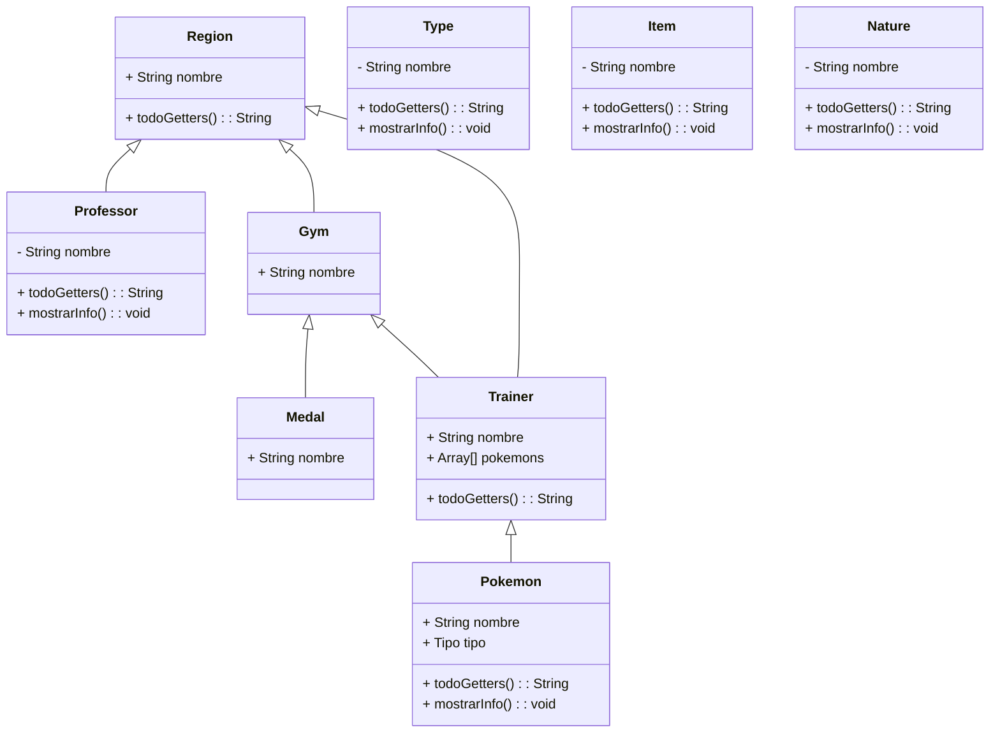

```mermaid
classDiagram
    class Region {
        + String nombre
        + todoGetters(): String
    }
 
    class Gym {
        + String nombre 

    }

    class Medal {
        + String nombre 
        
    }

    class Trainer  {
       
        + String nombre
        + Array[] pokemons
        + todoGetters(): String
    }

    class Pokemon  {
        
        + String nombre
        + Tipo tipo
        + todoGetters(): String
        +  mostrarInfo(): void
    }

    class Professor  {
        
        - String nombre
        + todoGetters(): String
        + mostrarInfo(): void
    }

    class Type  { 
        - String nombre
        + todoGetters(): String
        + mostrarInfo(): void
    }
    class Item  { 
        - String nombre
        + todoGetters(): String
        + mostrarInfo(): void
    }

    class Nature  {
        - String nombre
        + todoGetters(): String
        + mostrarInfo(): void
    }


    Gym <|-- Medal
    Trainer <|-- Pokemon
    Region <|-- Professor
    Region <|-- Gym
    Region <|-- Trainer
    Gym <|-- Trainer
```