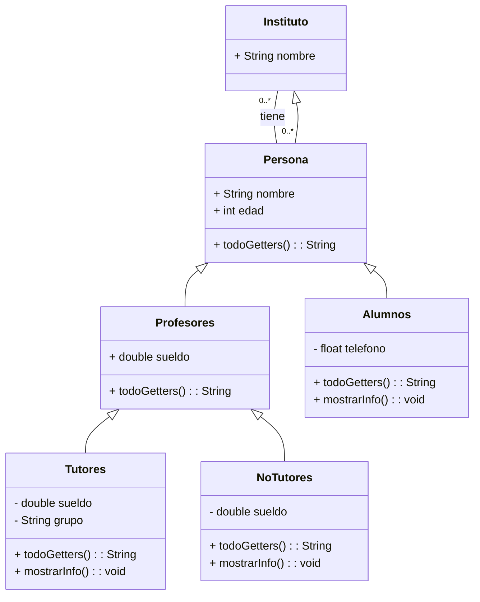

```mermaid
classDiagram
    class Persona {
        + String nombre
        + int edad
        + todoGetters(): String
    }
 
    class Instituto {
        + String nombre 
    }

    class Profesores  {
       
        + double sueldo
        + todoGetters(): String
    }

    class Tutores  {
        
        - double sueldo
        - String grupo
        + todoGetters(): String
        +  mostrarInfo(): void
    }

    class NoTutores  {
        
        - double sueldo
        + todoGetters(): String
        + mostrarInfo(): void
    }

    class Alumnos  {
        
        - float telefono
        + todoGetters(): String
        + mostrarInfo(): void
    }

    Instituto "0..*"--"0..*"Persona: tiene


    Profesores <|-- Tutores
    Profesores <|-- NoTutores
    Persona <|-- Profesores
    Persona <|-- Alumnos
    Instituto <|-- Persona
```