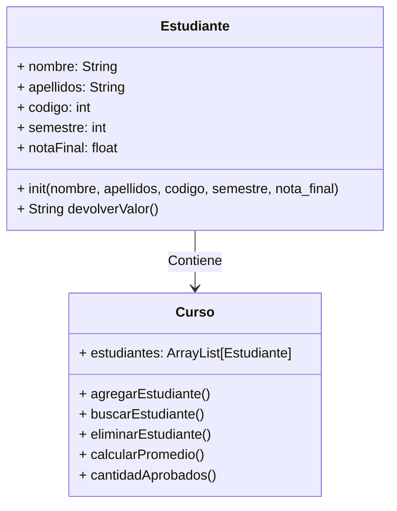

```mermaid

classDiagram
    class Estudiante {
        + nombre: String
        + apellidos: String
        + codigo: int
        + semestre: int
        + notaFinal: float
        + init(nombre, apellidos, codigo, semestre, nota_final)
        + String devolverValor()
    }

    class Curso {
        + estudiantes: ArrayList[Estudiante]
        + agregarEstudiante()
        + buscarEstudiante()
        + eliminarEstudiante()
        + calcularPromedio()
        + cantidadAprobados()
    }

    Estudiante --> Curso : Contiene

```